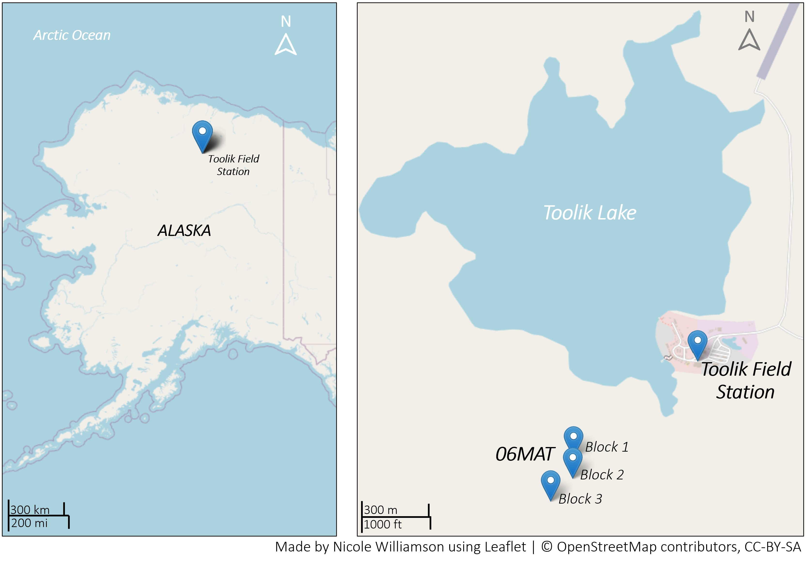
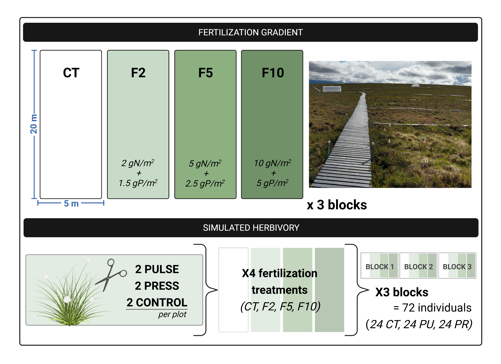

```{r setup, include=FALSE}
knitr::opts_chunk$set(echo = TRUE)
```

```{r, include=FALSE}
colorize <- function(x, color) {
  if (knitr::is_latex_output()) {
    sprintf("\\textcolor{%s}{%s}", color, x)
  } else if (knitr::is_html_output()) {
    sprintf("<span style='color: %s;'>%s</span>", color,
      x)
  } else x
}
```  

`r colorize("*All graphics were created by **Nicole Williamson**. Please notify creator before using, and cite credit for the work accordinly.*", "Red")`  

- nwilli51@students.towson.edu  


```{r, include=FALSE}
library("xfun")
```

```{r, echo=FALSE}
xfun::embed_files(c('../Images/LTER_experimental_design.png', '../Images/LTER_SITE_MAP.png'), text = 'Click HERE to download images')
```  

## Interactive map of study site locations
```{r, echo=FALSE, message=FALSE, warning=FALSE}
library("leaflet")

locations <- read.csv("../Data/Toolik_location.csv")

leaflet(locations) %>% 
  addTiles() %>%
  addScaleBar() %>%
  addMarkers(lng = ~Long, lat = ~Lat, popup = ~ Location)
```

### Still image of study site locations:  

  


## LTER 06MAT fertilization gradient and simulated herbivory experimental design  
06MAT simulated herbivory experimental design. Three blocks, each containing four 5x20m fertilization plots (CT, F2, F5, and F10). Each fertilization plot has two control (CT), two pulse (PU), and two press (PR) individuals within them. This provides 6 replicates for each of the 12 possible combinations of fertilization and simulated herbivory (72 individuals total).

  


