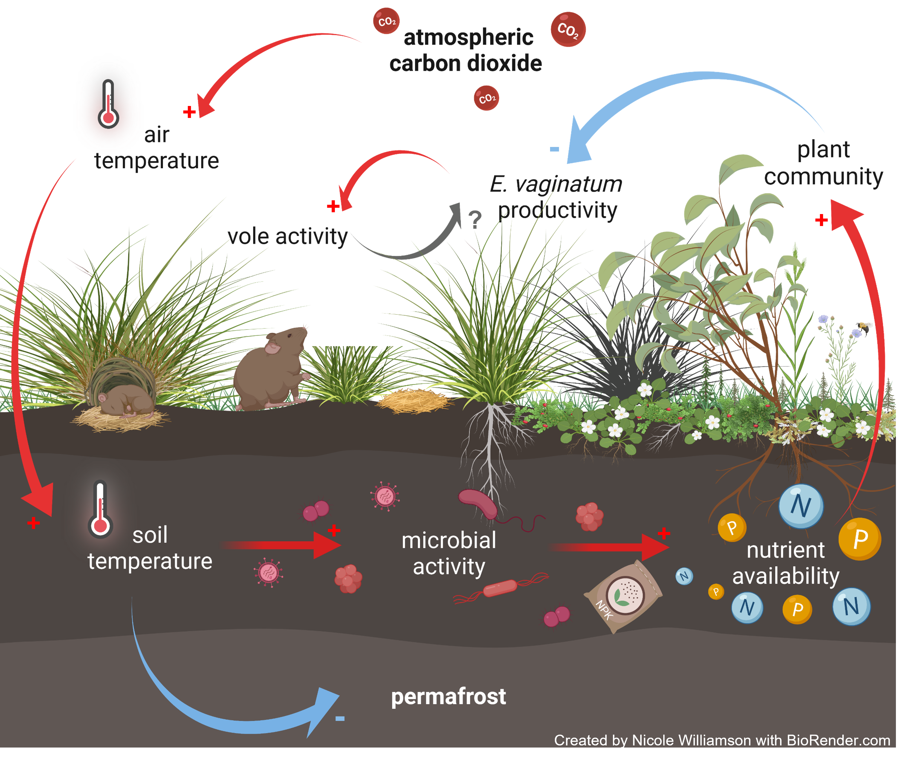
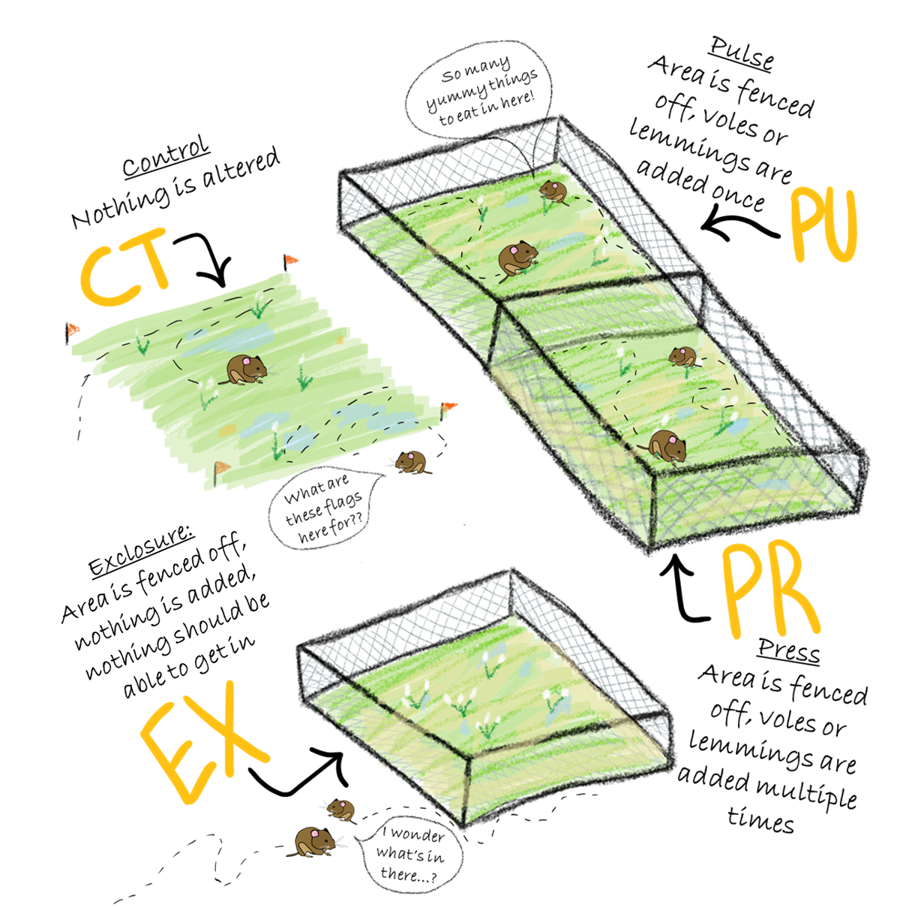

```{r setup, include=FALSE}
knitr::opts_chunk$set(echo = TRUE)
```

```{r, include=FALSE}
colorize <- function(x, color) {
  if (knitr::is_latex_output()) {
    sprintf("\\textcolor{%s}{%s}", color, x)
  } else if (knitr::is_html_output()) {
    sprintf("<span style='color: %s;'>%s</span>", color,
      x)
  } else x
}
```  

`r colorize("*All graphics were created by **Nicole Williamson**. Please notify creator before using, and cite credit for the work accordinly.*", "Red")`  

- nwilli51@students.towson.edu  


```{r, include=FALSE}
library("xfun")
```

```{r, echo=FALSE}
xfun::embed_files(c('../Images/Tundra_model.png', '../Images/Team_vole_experimental_design.png', '../Images/Vole_activity.png'), text = 'Click HERE to download images')
```  


### Figure 1:
Model of climate change driven nutrient addition impacts on interspecific competition, and vole herbivory of E. vaginatum. Red arrows indicate positive feedbacks, blue indicate negative feedbacks, and gray indicates that the effect can be positive or negative depending on the abundance. The cumulative effects of these disturbances are unclear.  

  


### Figure 2: 
Team voles experimental design explained. This setup is repeated three times at each of our locations (Toolik, Barrow, and Nome).  

  


### Figure 3:  
Exampled of vole activity, especially pertaining to *E. vaginatum* (1) voles eat the rhizomes of E. vaginatum which servers and kill the leaves (2) voles bury into the tussock mounds for shelter (3) voles eat the leaves off the top of tussocks (4) in the winter voles shelter within the subnivean zone and use chopped up E. vaginatum leaves as bedding. They create tunnels through the snow to access food stores.  


  
