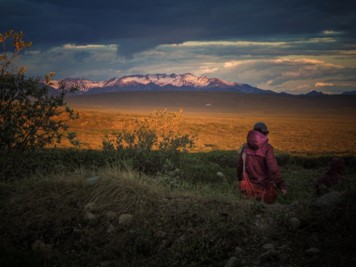

```{r setup, include=FALSE}
knitr::opts_chunk$set(echo = TRUE)
```

```{r, include=FALSE}
library("xfun")
```


 

```{r, echo=FALSE}
xfun::embed_file('../Images/Vole_moss.jpg', text = 'Click HERE to download image')
```   


 
```{r, echo=FALSE}
xfun::embed_file('../Images/Vole_Nick_release.jpg', text = 'Click HERE to download image')
```   


 
```{r, echo=FALSE}
xfun::embed_file('../Images/Vole_Jess_hand.jpg', text = 'Click HERE to download image')
```   


 
```{r, echo=FALSE}
xfun::embed_file('../Images/Vole_Nick_hand.jpg', text = 'Click HERE to download image')
```  


   
```{r, echo=FALSE}
xfun::embed_file('../Images/Lauren_Jess_HerbivoryTransect.jpg', text = 'Click HERE to download image')
```    


 
```{r, echo=FALSE}
xfun::embed_file('../Images/TheBoys_HerbivoryTransect.jpg', text = 'Click HERE to download image')
```  


 
```{r, echo=FALSE}
xfun::embed_file('../Images/Jess_Earl_Sourcing.jpg', text = 'Click HERE to download image')
```  


 
```{r, echo=FALSE}
xfun::embed_file('../Images/Jess_Lauren_MidnightSun.jpg', text = 'Click HERE to download image')
```  


 
```{r, echo=FALSE}
xfun::embed_file('../Images/Lauren_MidnightSun.jpg', text = 'Click HERE to download image')
```  


 
```{r, echo=FALSE}
xfun::embed_file('../Images/Ian_Ruby_Miriam_Greenhouse.jpg', text = 'Click HERE to download image')
```  


