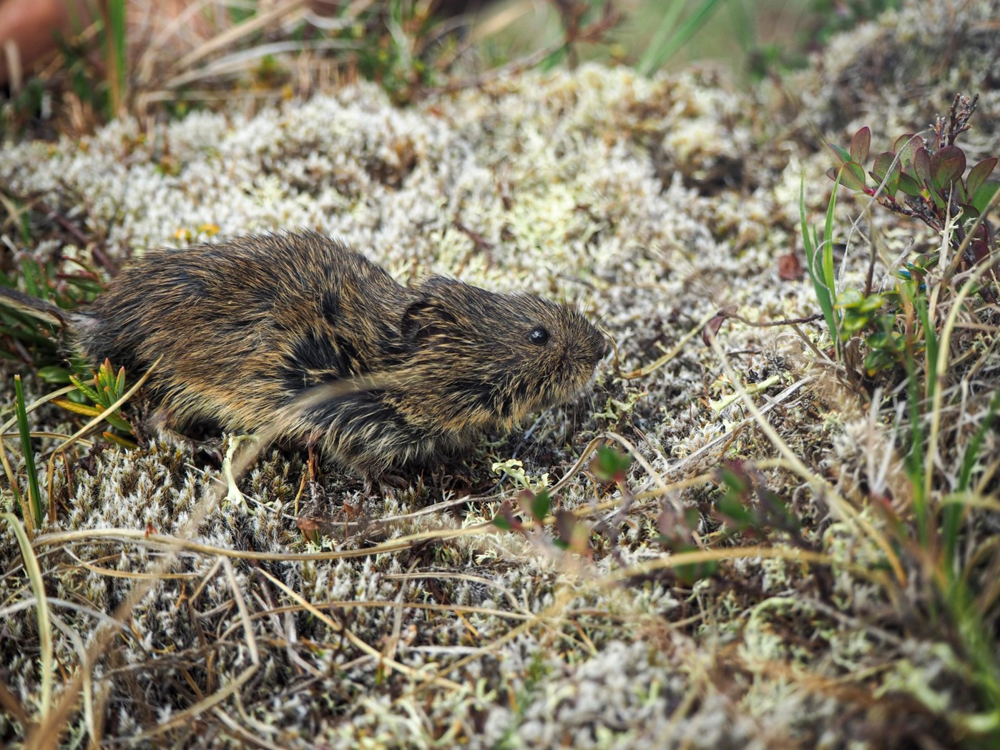
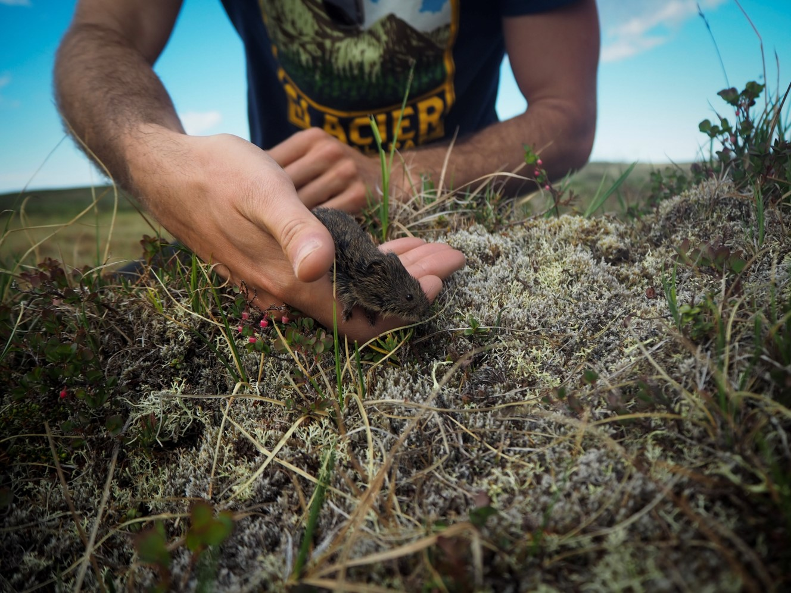
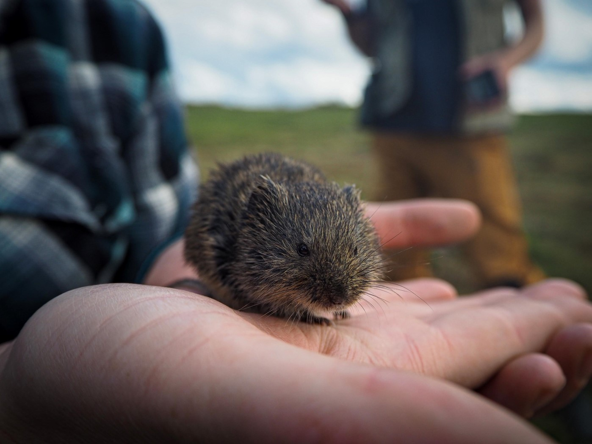
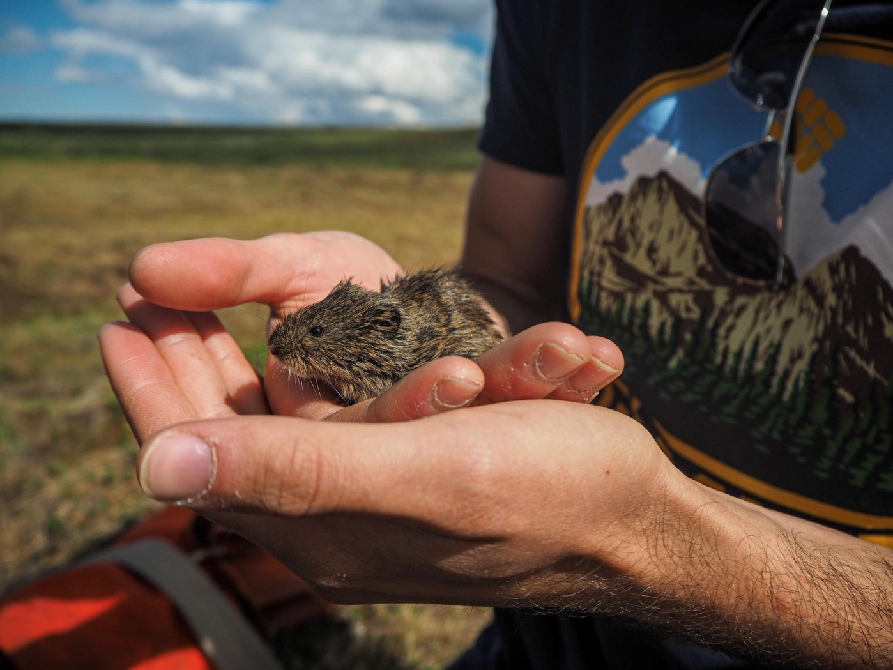
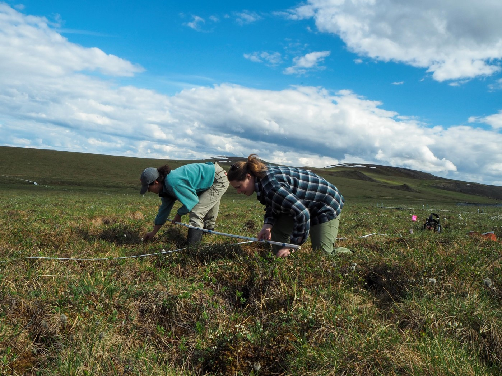
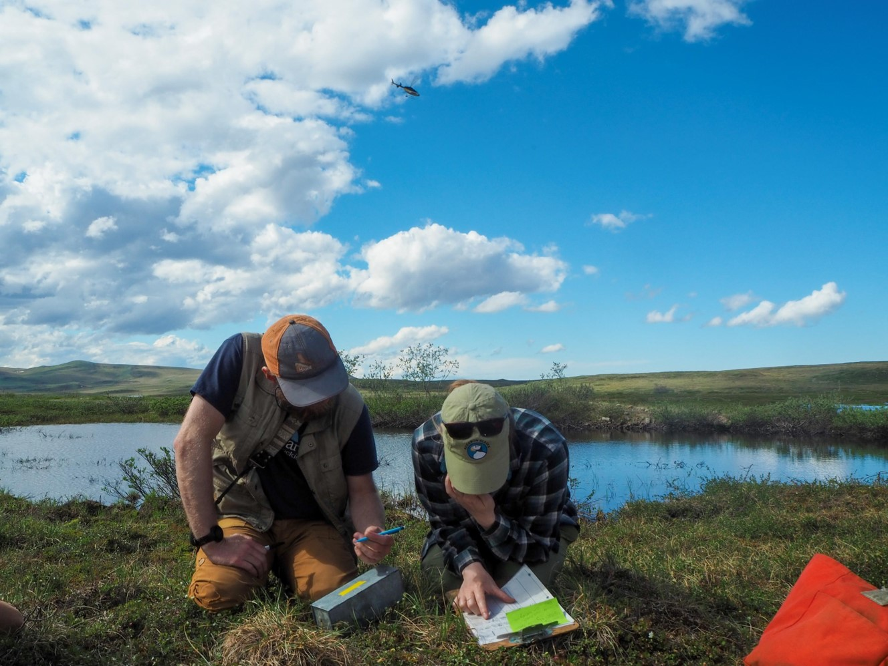
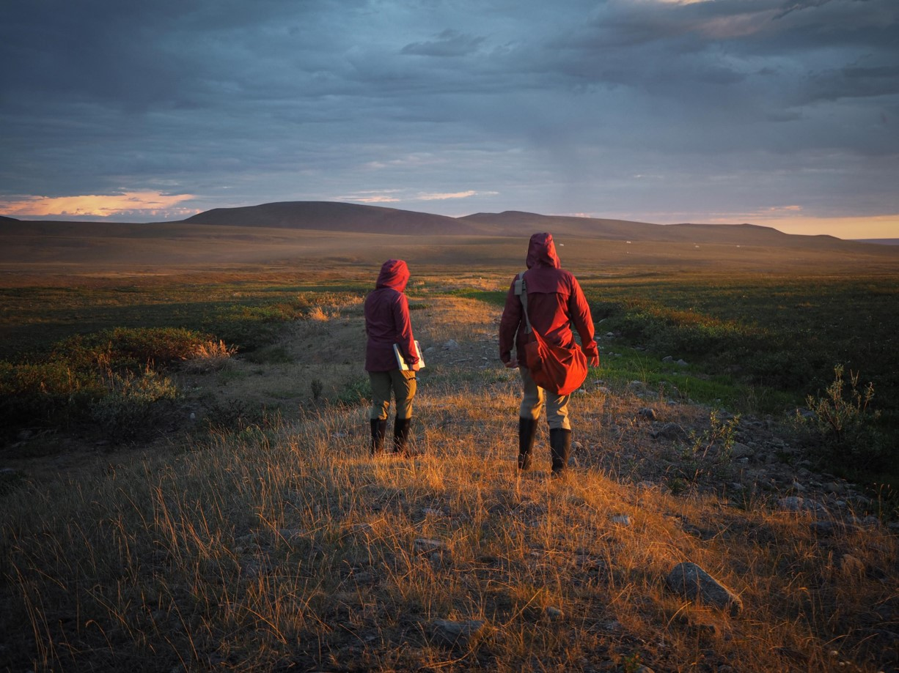
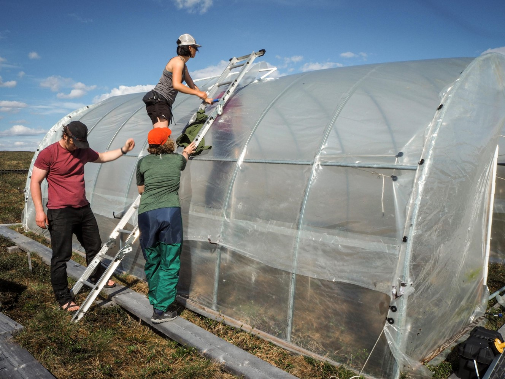

```{r setup, include=FALSE}
knitr::opts_chunk$set(echo = TRUE)
```

```{r, include=FALSE}
colorize <- function(x, color) {
  if (knitr::is_latex_output()) {
    sprintf("\\textcolor{%s}{%s}", color, x)
  } else if (knitr::is_html_output()) {
    sprintf("<span style='color: %s;'>%s</span>", color,
      x)
  } else x
}
```  

`r colorize("*All photos were taken by **Nicole Williamson**. Please notify creator before using, and cite credit for the work accordinly.*", "Red")`  

- nwilli51@students.towson.edu  


 


 


 


 


 


 


 


 


 


