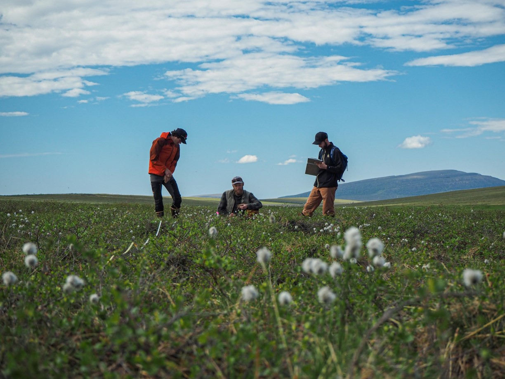

```{r setup, include=FALSE}
knitr::opts_chunk$set(echo = TRUE)
```

```{r, include=FALSE}
#
```


## Helpful tutorials:  

[Sharable leaflet map code](Rmd/Sharable-map-code.html)    

### Fun graphics/pictures:  

[Team vole graphics](Rmd/Team_vole_graphics.html)  

[Summer 2021 feild photos](Rmd/summer_2021_feild_photos.html)

[LTER graphics](Rmd/LTER_graphics.html)

### Thesis -- codes for cleaning and analyzing datasets:   

[Simulated Herbivory](Rmd/Simulated_Herbivory.html)  

[LTER_COVER](Rmd/LTER_06MAT_cover_thesis.html)  

[Team Vole Cover](Rmd/Team_Vole_cover.html) 


